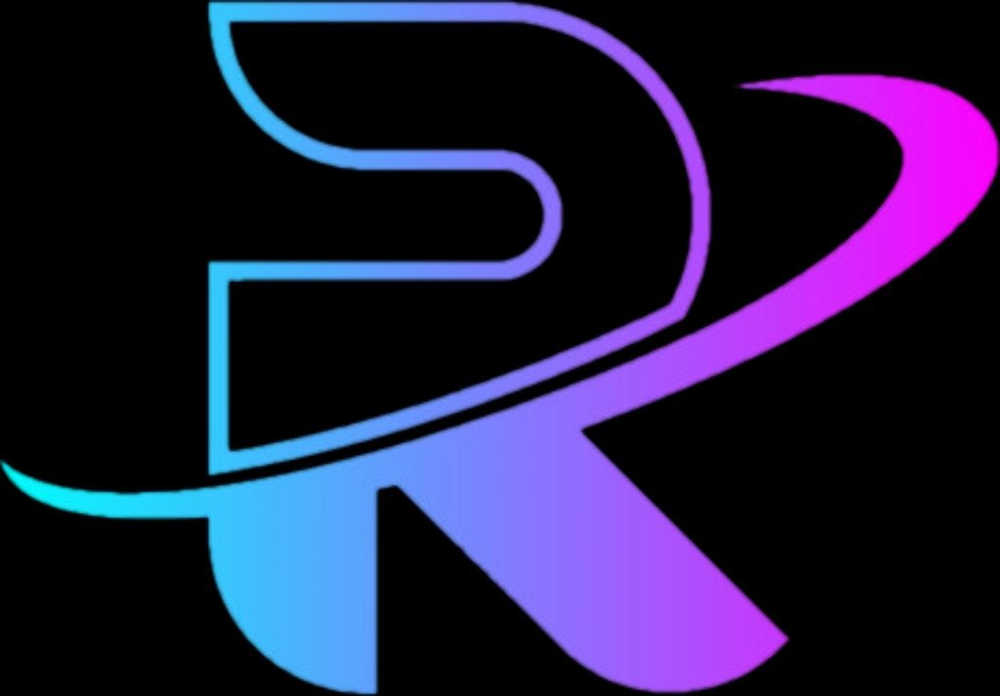

<div align="center">
  
  <div style="margin:1rem,auto,0rem,auto;font-size:100%;letter-spacing:1px;font-variant-caps:all-small-caps;width:min(480px, 80ch)">
    Recoil is a custom theme supporting modern systems programming
  </div>
</div>

## Description

This extension provides the kind of color theme that I simply could not find anywhere, despite looking for
hours. Every theme had defects, or missing features that I needed for maximum productivity. Instead of putting
together a "solution" which simply overrided some common theme, I created my own from the ground up.

### Official Language Support

The following languages and serialization formats are supported:

- [`Rust`][rust-lang]
- [`Zig`][zig-lang]
- [`Go`][go-lang]
- [`TOML`][toml-fmt]
- [`JSON`][json-fmt]
- [`YAML`][yaml-fmt]

If you find that something is missing, or inconsistent, please feel free to open an issue so we can address it as quickly as possible. Thanks!

## Development Status

This project is currently under **active development**.

### Should I use This?

This theme is tailored to my specific needs, which are largely centered around working with [`Rust`][rust-lang]
and [`Zig`][zig-lang]. Occasionally, I work with some other languages related to systems programming,
such as [`Go`][go-lang] and others. I try to give most common languages at least rudimentary support.
However, I do not guarantee support outside of the list of supported languages.

**TL;DR**: If you do not work with the languages listed above, then this extension is probably not for you! And that is okay! Also, if you would like to see a language added and don't mind helping out, I would absolutely love contributions!!

### Availability

This extension is available for both VSCodium and VSCode. It is published to both extension registries and should be easy to install. Simply install it as you would any other extension.

This extension is available for both VSCodium (without added telemetry) and VSCode, with the former prioritized as that is the editor I personally use.

- [x] VSCodium (distribution of VSCode with telemetry **removed**)
- [x] VSCode (contains closed-source code with added telemetry)

### Customization

Unfortunately, I cannot cover every use-case and there will inevitably be clashes of colors. I do my best to prevent this, but if you find that there is something you do not like, you can override it in your `settings.json` config file.

To customize and override rules, add the following to your settings file and tweak it as desired:

```jsonc
"editor.tokenColorCustomizations": {
  /*
  ...
  Add your overrides here
  ...
  */
},
```

## Future Goals

- [ ] Continued, iterative development for existing languages
- [ ] Addition of more languages
- [ ] Automate generation of the color scheme
  - [ ] Automate a parser that reads an input theme file
  - [ ] Alphabetize the input file and remove duplicate entries
  - [ ] Expand CI/CD automation capabilties with scripts and/or binaries
- [ ] Automatic validation of color scheme
  - [ ] Rules that violate the schema will be removed automatically
  - [ ] Add interactive mode to avoid accidental removal of needed entries

### Contributors Needed

Incremental support for more and more languages will be added over time. There is currently only a
single contributor (myself), and I have a have many things going on right now, so I could really use
help maintaining this extension.

If you would like to see something added, please consider [contributing to the project](#contributing).

## Installation

This extension can be found on [Open VSX][open-vsx]. This option is the easiest and most straightforward.
[Install the extension](#open-vsx), enable it and you should be all set. From there, you may customize the
theme as you see fit.

To build the project from source, please see: [Building from Source](#building-from-source).

### Open VSX

[Open VSX][open-vsx] allows you to install `recoil` just as you would any other extension.

After installation is complete, simply set your color theme to `Recoil`.

### Building from Source

This is free software. As such, the source code is hosted publicly and made available to anyone that wishes to view the source code.

The extension is currently [hosted on GitHub][project-repo]. You can clone it, modify it, fork it or do whatever you like with it.

To build this project manually, from source:

- Clone the repository
- `cd` into the repository
- Run the `build` script using `npm run build`
- Install the VSIX (VSCodium extension)
  - From your terminal console (see below).
  - Right-click on the generated **vsix** file, then **`Install Extension VSIX`**
  - Run the following command within VSCodium: **`Extensions: Install from VSIX`**

```shell
git clone https://github.com/ellacrity/recoil-vscodium-theme
cd recoil-vscodium-theme
npm run build
# Substitute ${version} with the version number defined in the `package.json` file.
codium --install-extension recoil-${version}.vsix
```

## Stability

I will do my best to follow semantic versioning, but there may be occasions where an accidental breaking change occurs. If this happens, please open an issue and I will get to it as quickly as possible.

## Contributing

Open a new ticket that outlines the scope of your contribution(s) and be ready to discuss your changes.

If your changes are approved, open a pull request and I will review your changes. If everything looks good, I will merge your contribution.

Following the above steps is the best way to ensure your contribution is accepted.

## License

This project is licensed under the [MIT license][license].

### Contribution

Unless you explicitly state otherwise, any contribution intentionally submitted for inclusion in
[`recoil`][project-repo] by you, shall be licensed as MIT, without any additional terms or conditions.

<!-- Local Links -->

[license]: https://github.com/ellacrity/recoil-vscodium-theme/blob/main/LICENSE
[changelog]: /CHANGELOG.md
[themes]: /themes

<!-- Links section -->

[project-repo]: https://github.com/ellacrity/recoil-vscodium-theme
[nerd-fonts]: https://github.com/ryanoasis/nerd-fonts
[open-vsx]: https://open-vsx.org/

<!-- Programming Languages -->

[go-lang]: https://go.dev/
[rust-lang]: https://www.rust-lang.org/
[zig-lang]: https://ziglang.org/

<!-- Serialization Formats -->

[json-fmt]: https://www.json.org/
[toml-fmt]: https://toml.io/en/
[yaml-fmt]: https://yaml.org/
